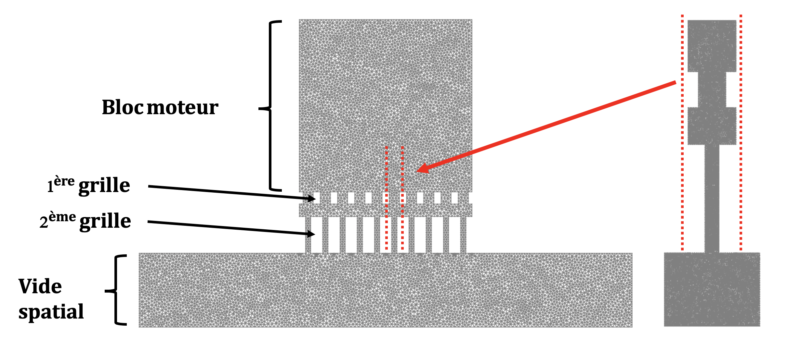
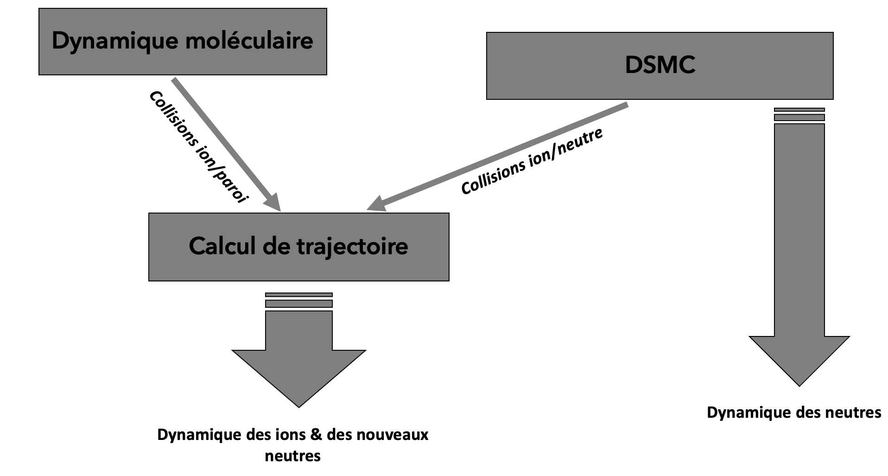

# Negative ions ray neutralization for satellite propulsion

This project took place in Ecole polytechnique (Palaiseau, France) engineering school third year and started in mid-September 2020 until mid-March 2021. It was then deepened as part of an internship by [one of the author](#PaulCalot).

This project is proposed and tutored by [*Laboratoire de Physique des Plasmas*](https://www.lpp.polytechnique.fr/?lang=fr) (Plasma Physics Laboratory) from Ecole polytechnique. Names of the tutors are given [below](#tutors).

## Short Description

This project studied the neutralization of a ion-ray exciting a satellite grid-thruster through negative-ions accelerating grids which also increase the collision rate and thus allows for a certain percentage of neutralization of the ray. 

A scheme of the thruster grids is given in picture [1](#schemeglobal). This project is composed of three parts in interaction expressed in figure [2](#projectorga).

<p align="center">
     <a name="schemeglobal"></a>
     <a name="projectorga"></a>
</p>

## Installation

Below is detailed the creation of a *conda* environment. It should be noted that problems may arise from *fenics* installation with more recent version (e.g. 2019). If you stick to a *conda* environment as described below, it should work without any issue.

For clarity purpose, we use the environment name : **NIRN** (for *Negative Ions Ray Neutralization*). However, you are completely free to use your own.

*Linux* and *Mac* users (without *Docker*):
<br>

```shell
conda create --name NIRN -c conda-forge fenics=2018 mshr=2018
conda activate NIRN
conda install -c conda-forge matplotlib=3.3.2
conda install -c anaconda scipy=1.5.2 
conda install -c conda-forge tqdm # progress bar
conda install pandas=1.0.5 
```

or more simple :

```shell
conda create --name NIRN -c conda-forge fenics=2018 mshr=2018  python pandas numpy matplotlib tqdm notebook jupyter lab
```


If you want to use *jupyter notebook* or *jupyter lab*, please install : 
```shell
conda install -c conda-forge notebook
conda install -c conda-forge jupyterlab
```

To handle slide show in the jupyter notebook :
```shell
conda install -c conda-forge rise
```

To handle animation saving :
```shell
conda install -c conda-forge ffmpeg
```

Additionnal packages may be needed if you choose to run the *Molecular Dynamic* (MD) code : 

```shell
 conda install -c plotly plotly
 conda install -c conda-forge gcc
```

**Note : *fenicsy* already contains *numpy* which is consequently installed whith *fenicsy*.**

*Sources* : 
* [*fenics* documentation](https://fenicsproject.org/documentation/)


## Use

Basic usage for the DSMC code is described in the *jupyter notebook* [tutorial](tutorial.ipynb) of the *DMSC* branch. As for the *MD* and trajectory codes, there is no tutorial available at the moment.

Four branches of the project exists at the moment :
- *master* : currently this is the *DSMC* branch, but it should recieve at some point a manual with *TRAJandMD*.
- *DSMC* :  the *Direct Simulation Monte Carlo* code branch.
- *TRAJandMD* : contains the ions trajectory analysis and geometry optimization along with the *C* MD code and an python interface with it.
- *old_MD* : you need not concern with this branch which is basically a *save* from *TRAJandMD* to get back to it quickly if necessary. Should be deleted once everything has been tested in *TRAJandMD*.

## Authors 

[Paul Calot](https://www.linkedin.com/in/paul-calot-43549814b/)<a name="PaulCalot"></a>
<br>
[Edouard Roger](https://www.linkedin.com/in/edouard-roger-a03536194/)

## Tutors <a name="tutors"></a>

[Pascal Chabert](https://www.lpp.polytechnique.fr/-Pascal-Chabert-128-?lang=fr)
<br>
[Benjamin Esteves](https://www.linkedin.com/in/benjamin-esteves-9a1234157/?originalSubdomain=fr)

